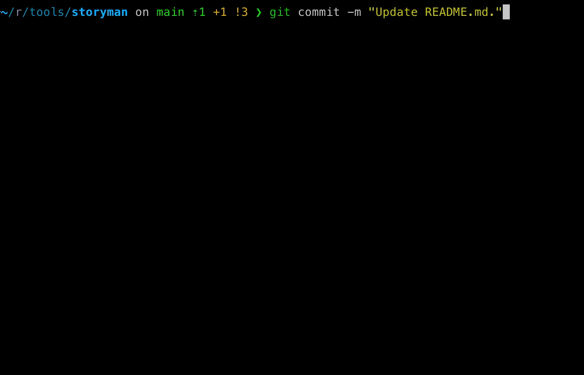

storyman
========

When using project-tracking tools such as Jira, it can be useful to include a story tag (such as EG-123) in commit
messages, so that changes can be linked to stories and vice versa.

Instead of doing so manually, which can be prone to inconsistency and mistakes, this tool automates the process by
rewriting commit messages to include the current story.



# Installation

Install through npm:

```sh-session
$ npm install -g storyman
```

In order to rewrite commit messages automatically, storyman will need to be installed in any Git repositories where
you want tagged commits.

This can be achieved by running  `story install` inside an existing Git repository:

```sh-session
$ cd ~/projects/some-project
$ story install
Created prepare-commit-msg hook for /home/shea/projects/some-project.
```

Or by passing a repository to `story install` as the first argument:

```sh-session
$ story install ~/projects/another-project
Created prepare-commit-msg hook for /home/shea/projects/another-project.
```

# Usage

## Story branches

storyman v2 has switched to a branch-based method of tracking stories. When working on a new story, create a Git branch
beginning with the story tag:

```sh-session
$ git checkout -b SM-124
```

Branch names can include an optional 'comment' following this story tag, which will be ignored by storyman:

```sh-session
$ git branch -m SM-124-introduce-x-feature
```

You check what the detected story is using `story`:

```sh-session
$ story
EG-123
```

## Augmenting commit messages

When making a commit, storyman will automatically add the current story tag to the beginning of the commit message:

```sh-session
$ git commit -m "Made some changes."
[EG-123 fb98b25] EG-123 Made some changes.
 1 file changed, 71 insertions(+), 3 deletions(-)
```

If you're commiting to a branch that does *not* begin with a story tag, such as `main`, storyman will notice and prompt
if you would like to add one to the commit message anyway:

```sh-session
$ git commit -m "Made some changes."
✔ [storyman] Commiting to a non-story branch. Enter a story to tag this commit, or
 leave blank to commit untagged: EG-123
[main fb98b25] EG-123 Made some changes.
 1 file changed, 71 insertions(+), 3 deletions(-)
```

## Commit protection

storyman has the ability to connect to your Jira instance to fetch information about the current story. This can be
initiated by running `story info`, where you will need to provide the Jira site URL and an API token.

Once this has been initialised, storyman will also validate the current story when making commits. If the story is
marked as resolved in Jira, a warning will be shown, and you will be prompted to confirm that you wish to proceed with
the commit:

```sh-session
$ git commit -m "Made some changes."
⚠ [storyman] Warning: EG-123 is resolved as 'Done'. Continue with this commit? (Y/n)
```

## Tagging authors

Storyman also supports workflows that involve also including the name of the commit authors in each message,
like this:

    EG-12 Made some changes. [Shea]

To enable this functionality, set the `defaultAuthor` configuration property:

```sh-session
$ story config set defaultAuthor Shea
```

If you specify an author in the commit message manually, storyman will attempt to detect this and refrain from adding
an author tag.

## Opening Jira

Storyman makes it easy to navigate from code to the Jira ticket you're currently working on.

Running the `story open` command will open the Jira ticket for the current story in the default web browser.

The first time you run this, it will prompt to enter a Jira site URL. This can be a URL to Jira cloud or to a
self-hosted instance:

```sh-session
$ story open
What is your Jira site URL?: https://something.atlassian.net/
Opening https://something.atlassian.net/browse/EG-12
```

# Command Reference

<!-- commands -->

* [`story config`](#story-config)
* [`story config clear PROP`](#story-config-clear-prop)
* [`story config list`](#story-config-list)
* [`story config set PROP VALUE`](#story-config-set-prop-value)
* [`story config unset PROP`](#story-config-unset-prop)
* [`story get`](#story-get)
* [`story help [COMMAND]`](#story-help-command)
* [`story info [STORY]`](#story-info-story)
* [`story install [REPO]`](#story-install-repo)
* [`story jira [STORY]`](#story-jira-story)
* [`story open [STORY]`](#story-open-story)
* [`story uninstall [REPO]`](#story-uninstall-repo)

## `story config`

Display the list of current configuration properties.

```
USAGE
  $ story config

DESCRIPTION
  Display the list of current configuration properties.

ALIASES
  $ story config list

EXAMPLES
  $ story config
  Reading configuration from file:///home/shea/.storyman.json
  defaultAuthor = "Shea"
  jiraUrl = "https://something.atlassian.net/"
```

_See
code: [src/commands/config/index.ts](https://github.com/sheabunge/storyman/blob/v2.1.1/src/commands/config/index.ts)_

## `story config clear PROP`

Reset a configuration property to its default value.

```
USAGE
  $ story config clear PROP

DESCRIPTION
  Reset a configuration property to its default value.

ALIASES
  $ story config clear

EXAMPLES
  $ story config unset defaultAuthor
```

## `story config list`

Display the list of current configuration properties.

```
USAGE
  $ story config list

DESCRIPTION
  Display the list of current configuration properties.

ALIASES
  $ story config list

EXAMPLES
  $ story config
  Reading configuration from file:///home/shea/.storyman.json
  defaultAuthor = "Shea"
  jiraUrl = "https://something.atlassian.net/"
```

## `story config set PROP VALUE`

Set a new value for a configuration property.

```
USAGE
  $ story config set PROP... VALUE...

DESCRIPTION
  Set a new value for a configuration property.

EXAMPLES
  $ story config set defaultAuthor Shea B
  defaultAuthor = Shea B
```

_See code: [src/commands/config/set.ts](https://github.com/sheabunge/storyman/blob/v2.1.1/src/commands/config/set.ts)_

## `story config unset PROP`

Reset a configuration property to its default value.

```
USAGE
  $ story config unset PROP

DESCRIPTION
  Reset a configuration property to its default value.

ALIASES
  $ story config clear

EXAMPLES
  $ story config unset defaultAuthor
```

_See
code: [src/commands/config/unset.ts](https://github.com/sheabunge/storyman/blob/v2.1.1/src/commands/config/unset.ts)_

## `story get`

Retrieve the story identifier from the current Git branch.

```
USAGE
  $ story get

DESCRIPTION
  Retrieve the story identifier from the current Git branch.

EXAMPLES
  $ story
  SM-12
```

_See code: [src/commands/get.ts](https://github.com/sheabunge/storyman/blob/v2.1.1/src/commands/get.ts)_

## `story help [COMMAND]`

Display help for story.

```
USAGE
  $ story help [COMMAND...] [-n]

ARGUMENTS
  [COMMAND...]  Command to show help for.

FLAGS
  -n, --nested-commands  Include all nested commands in the output.

DESCRIPTION
  Display help for story.
```

_See code: [@oclif/plugin-help](https://github.com/oclif/plugin-help/blob/v6.2.35/src/commands/help.ts)_

## `story info [STORY]`

View information about a story.

```
USAGE
  $ story info [STORY]

ARGUMENTS
  [STORY]  Fetch information for this story, instead of the current story.

DESCRIPTION
  View information about a story.

EXAMPLES
  $ story info
  Current story is SM-123: Example story name.
```

_See code: [src/commands/info.ts](https://github.com/sheabunge/storyman/blob/v2.1.1/src/commands/info.ts)_

## `story install [REPO]`

Install the git prepare-commit-msg hook.

```
USAGE
  $ story install [REPO] [-f]

ARGUMENTS
  [REPO]  [default: .] Path to Git repository. Defaults to current directory.

FLAGS
  -f, --force  override an existing prepare-commit-msg hook

DESCRIPTION
  Install the git prepare-commit-msg hook.

  Install the git `prepare-commit-msg` hook.

EXAMPLES
  $ story install
  Created prepare-commit-msg hook for /home/shea/projects/some-project.

  $ story install ~/projects/another-project
  Created prepare-commit-msg hook for /home/shea/projects/another-project.
```

_See code: [src/commands/install.ts](https://github.com/sheabunge/storyman/blob/v2.1.1/src/commands/install.ts)_

## `story jira [STORY]`

Open the active story in Jira.

```
USAGE
  $ story jira [STORY]

ARGUMENTS
  [STORY]  Open this story, instead of the current story.

DESCRIPTION
  Open the active story in Jira.

ALIASES
  $ story jira

EXAMPLES
  $ story open
  Opening https://something.atlassian.net/browse/SM-12

  $ story open 42
  Opening https://something.atlassian.net/browse/SM-42

  $ story open TS-19
  Opening https://something.atlassian.net/browse/TS-19
```

## `story open [STORY]`

Open the active story in Jira.

```
USAGE
  $ story open [STORY]

ARGUMENTS
  [STORY]  Open this story, instead of the current story.

DESCRIPTION
  Open the active story in Jira.

ALIASES
  $ story jira

EXAMPLES
  $ story open
  Opening https://something.atlassian.net/browse/SM-12

  $ story open 42
  Opening https://something.atlassian.net/browse/SM-42

  $ story open TS-19
  Opening https://something.atlassian.net/browse/TS-19
```

_See code: [src/commands/open.ts](https://github.com/sheabunge/storyman/blob/v2.1.1/src/commands/open.ts)_

## `story uninstall [REPO]`

Uninstall the git prepare-commit-msg hook.

```
USAGE
  $ story uninstall [REPO]

ARGUMENTS
  [REPO]  [default: .] Path to Git repository. Defaults to current directory.

DESCRIPTION
  Uninstall the git prepare-commit-msg hook.

  Uninstall the git `prepare-commit-msg` hook.

EXAMPLES
  $ story uninstall
  Removed prepare-commit-msg hook from /home/shea/projects/some-project.

  $ story uninstall ~/projects/another-project
  Removed prepare-commit-msg hook from /home/shea/projects/another-project.
```

_See code: [src/commands/uninstall.ts](https://github.com/sheabunge/storyman/blob/v2.1.1/src/commands/uninstall.ts)_
<!-- commandsstop -->
